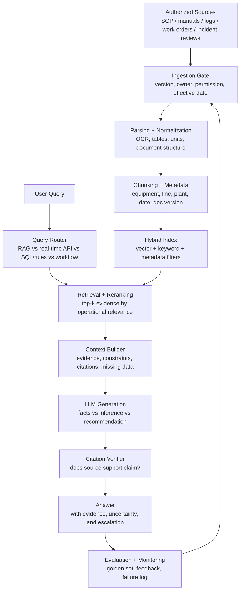

# 2026-06-14 D02 - RAG Pipeline as Failure Surface

Project: `industrial-ai-saas-builder`  
Progress: `D02 / 第2/34天`  
Status: teaching and required output complete; independent recall pending  
Timezone: Australia/Sydney

## Session Context

The user continued immediately after completing D01. Per the no-D000 acceleration rule, the session advanced to the next real lesson number: D02 / 第2/34天.

The user said that if they do not answer, it means they do not know the answer and Codex should teach directly. Therefore D02 used worked-answer teaching mode instead of asking the user to fill another template.

## Core Concept

RAG is not an answer machine. RAG is an evidence-chain system.

The important Top 1% judgment is not "is this RAG accurate?" but "where did the evidence chain break?"

Formula:

```text
RAG answer quality = source quality * parsing quality * retrieval quality * context quality * generation constraint * citation verifiability
```

## Industrial Case

Question from an operator:

```text
A1 alarm: how was this handled before?
```

A weak RAG system may answer:

```text
According to SOP-2024-03, A1 alarm is usually related to pressure fluctuation.
Recommended action: check the pressure sensor, valve state, and restart the pump group.
Source: SOP-2024-03
```

The answer has a citation but can still be wrong.

## Failure Surface

| Pipeline | Chinese | Failure | Industrial consequence | How to check |
|---|---|---|---|---|
| Source | 资料源 | SOP is outdated, missing, wrong version, or wrong owner | The system cites an obsolete process | Check source, date, version, owner, effective scope |
| Parsing | 解析 | OCR misreads A1 as AI or A7; tables/units are lost | Alarm code or parameter is misread | Compare extracted text with original PDF/image/table |
| Chunking | 切块 | Cause, restriction, and treatment steps are split apart | The answer sees cause but misses "do not restart" | Inspect retrieved chunks for complete local context |
| Metadata | 元数据 | Wrong line, equipment, plant, version, or date tags | Similar but non-applicable SOP is retrieved | Check metadata filter against the live scenario |
| Embedding | 向量化 | Semantic similarity does not equal business relevance | Generic explanation outranks the right procedure | Inspect top-k results for actual operational relevance |
| Index | 索引 | New sources not indexed; old sources not removed | The system cannot find fresh evidence | Check index freshness and document coverage |
| Query routing | 查询路由 | A real-time question is routed to document RAG | Current temperature is answered from stale documents | Decide whether the query should use API/DB/dashboard/rules |
| Retrieval | 检索 | Correct evidence exists but is not retrieved | LLM must guess from incomplete evidence | Use golden questions and recall@k tests |
| Reranking | 重排序 | Correct evidence is rank 8; weak evidence is rank 1 | The answer relies on weak evidence | Compare retrieval before and after reranking |
| Context packing | 上下文打包 | Correct evidence is retrieved but excluded from final prompt | LLM never sees the critical constraint | Inspect final context actually sent to the LLM |
| Generation | 生成 | The model overstates, hallucinates, or turns advice into commands | "Consider checking" becomes "restart now" | Require facts, inference, advice, and forbidden actions to be separated |
| Citation | 引用 | Citation exists but does not support the conclusion | The answer looks auditable but is not actually grounded | Check whether the cited sentence directly supports the claim |
| Evaluation | 评估 | Only answer fluency is tested | Demo looks good but production behavior is unsafe | Test groundedness, freshness, usefulness, and business validity |
| Monitoring | 监控 | Failure cases are not logged after deployment | The same wrong answer repeats | Log failed answers, user feedback, source fixes, and retraining/reindexing actions |

## Minimal Auditable Industrial RAG Architecture



## Practical Use Rule

When judging an industrial AI SaaS RAG product, ask in this order:

1. Are the sources authorized, current, scoped, and owned?
2. Can the system prove parsing did not corrupt the key facts?
3. Are chunks complete enough to preserve cause, constraint, and action?
4. Is metadata strong enough to avoid wrong equipment or wrong version?
5. Does routing send real-time questions to live APIs instead of RAG?
6. Can retrieval and reranking find the right evidence in top results?
7. Can the final prompt/context be inspected?
8. Does the answer separate fact, inference, recommendation, and forbidden action?
9. Does each citation directly support the claim it is attached to?
10. Are failures logged and used to repair sources, metadata, retrieval, or prompts?

## ROI Interpretation

The ROI of industrial RAG does not come from "chatbot intelligence." It comes from reducing the cost of evidence lookup, onboarding, troubleshooting, handover, audit preparation, and repeated expert interruption.

RAG creates business value when it shortens high-frequency, evidence-heavy work while making answers easier to check and repair.

RAG destroys value when it gives confident but ungrounded operational advice, uses stale procedures, or hides the source of error.

## Notion Note Body

```markdown
## 2026-06-14 D02：RAG Pipeline as Failure Surface

进度：第2/34天。D02 的核心不是记住 RAG 有哪些组件，而是学会判断一个 RAG 答案错在哪里。

RAG 不是答案机器，而是证据链系统。答案质量取决于资料源、解析、切块、元数据、检索、重排序、上下文打包、生成、引用、评估和监控是否连续可靠。

核心公式：

RAG 答案质量 = 资料源质量 × 解析质量 × 检索质量 × 上下文质量 × 生成约束 × 引用可验证性

最小可审计工业 RAG 架构：

1. Authorized Sources 授权资料源：SOP、手册、日志、工单、事故复盘。
2. Ingestion Gate 入库门禁：确认版本、负责人、权限、有效日期。
3. Parsing + Normalization 解析与标准化：处理 OCR、表格、单位、文档结构。
4. Chunking + Metadata 切块与元数据：绑定设备、产线、日期、版本、文档类型。
5. Hybrid Index 混合索引：vector search + keyword search + metadata filter。
6. Query Router 查询路由：判断该走 RAG、实时 API、SQL/rules 还是 workflow。
7. Retrieval + Reranking 检索与重排序：找证据，并把业务最相关证据排前面。
8. Context Builder 上下文构造：把证据、限制条件、引用、缺失信息交给 LLM。
9. LLM Generation 生成：区分事实、推断、建议和禁止动作。
10. Citation Verifier 引用验证：检查引用是否真的支持结论。
11. Evaluation + Monitoring 评估与监控：用标准问题、失败日志、用户反馈持续修复。

关键判断：

有 citation 不等于答案可靠。citation 只能说明系统指向了一个来源，不能证明来源正确、适用、最新，也不能证明答案真的由这个来源支持。

Top 1% 判断力：

不要只问“这个 RAG 准不准”。要问“证据链在哪一层断了”。
```

## Recall Gate For Next Session

D02 teaching and required output are complete, but independent recall has not yet been tested.

Before D03, ask:

1. 为什么有 citation 不等于答案可靠？
2. 如果答案引用了错误 SOP，可能是哪几层出了问题？
3. 为什么实时温度/压力问题不应 RAG-first？

Pass threshold: at least 4/5 on citation reliability, source/metadata/retrieval diagnosis, and routing boundary.

## Next Lesson Map

| Day | Topic | Output |
|---|---|---|
| D02 recall gate | Citation reliability + failure localization | 3-question micro recall |
| D03 | RAG eval and trust boundary | Eval rubric + 20-question eval set |
| D04 | Industrial SaaS workflow ROI | Workflow ROI map |
| D05 | MVP boundary | MVP scope kill-list |
| D06 | Monetization assumption | Pricing / monetization assumption table |
| D07 | W1 calibration | W01 calibration + product thesis v0.1 |

